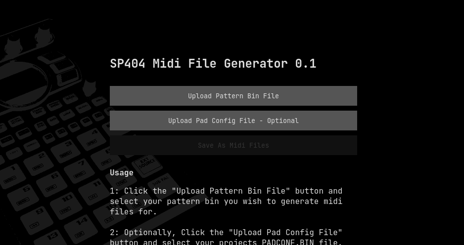

# SP404 Mk2 Midi File Generator

Simple js application for reading in .bin files exported from the SP404 mk2 and generating individual midi files for each pad individually.

The built in midi export of the Roland SP404 app exports as only one midi file which was not condusive to my personal work flow. If having a way to export to multiple midi files is something you want, give it a go.

